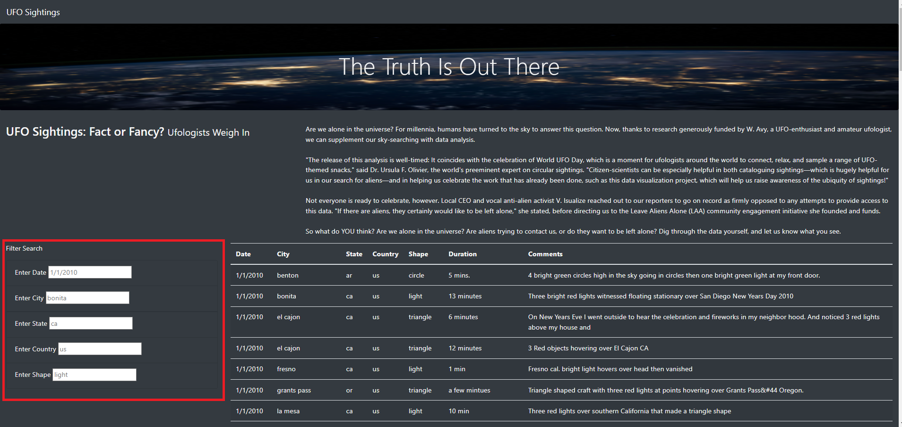
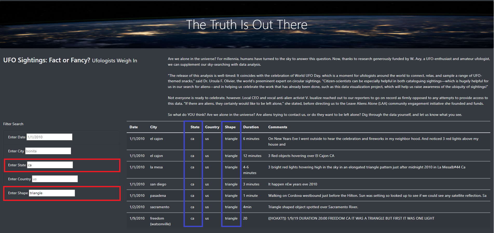

# UFOs

## Table of Contents
- [Overview of Project](#OverviewProject)
- [Results](#Results)
  * [Website Functionality](#Website)
  * [Code](#Code)
- [Summary](#Summary)
- [Resources](#Resources)

## Overview of Project

In this project we are building a website to show different UFO sightings [[1]](#1) using JavaScript, HTML, CSS and D3. The UFO sighting data [[2]](#2) is collected and filtered JavaScript code [[3]](#3) and displayed using HTML [[1]](#1).Some of the website's csutomization was done in the HTML file and some was done in the CSS file [[4]](#4). The website has dynamic functionality for filtering the data displayed. D3 is ustilized to recognize the user inputs ("changes") to the website and filter the information accordingly. 

## Results

###  Website Functionality

The website created automatically loads all the data into its UFO Sightings table. It is then able to filter data based on user input, as seen in Figure 1 and 2. Once the filter information is written for any of the categories, the user hits enter and the table updates the results to match only those shown as part of those filters. Multiple categories can be filtered at the same time, as seen in Figure 2.  

  

 Figure 1: Website Layout
 

  

 Figure 2: Filtered Data
 

### Code

In order to achieve this filtering capabilities, the Java Script file had 3 funtions built into it. In the first funtion we create a table to be displayed in the HTML file based on the amount of data points we have. We create a row per data point (UFO sighting) and attach the information of each catergory to each cell of the table.

In the secound function, we use D3 to detect a user entry into the filters of the website and then we record the information entered and the field for which the filter was entered. 

In the last function we evaluate the user input against the data points available to us. We then filter the data to only show in the table the data that matches the user inputed filters. 

...

    function buildTable(data) {
      // First, clear out any existing data
      tbody.html("");

      // Next, loop through each object in the data
      // and append a row and cells for each value in the row
      data.forEach((dataRow) => {
        // Append a row to the table body
        let row = tbody.append("tr");

        // Loop through each field in the dataRow and add
        // each value as a table cell (td)
        Object.values(dataRow).forEach((val) => {
          let cell = row.append("td");
          cell.text(val);
        });
      });
    }

...

...

    var filters = {}

    let filteredData = tableData;
    // 3. Use this function to update the filters. 
    function updateFilters() {

        // 4a. Save the element that was changed as a variable.
        let inputElement =d3.event.target;
        console.log(inputElement)
        // 4b. Save the value that was changed as a variable.
        let inputText = inputElement.value;
        console.log(inputText)
        // 4c. Save the id of the filter that was changed as a variable.
        let inputID = inputElement.id;
        console.log(inputID)
        // 5. If a filter value was entered then add that filterId and value
        // to the filters list. Otherwise, clear that filter from the filters object.

        if (inputText) {
          filters[inputID] = inputText;
        }
        console.log(filters)
        // 6. Call function to apply all filters and rebuild the table
        filterTable(filters);

      }

...

...

      // 7. Use this function to filter the table when data is entered.
      function filterTable() {

        // 8. Set the filtered data to the tableData.

        filteredData = tableData
        // 9. Loop through all of the filters and keep any data that
        // matches the filter values

        Object.entries(filters).forEach(function ([key,value]) {
          filteredData = filteredData.filter(row => row[key] === value);
        });

        // 10. Finally, rebuild the table using the filtered data
        buildTable(filteredData);
      }

...

##  Summary

We were succesfully able to build a website that presents the UFO sighting data and has five filtering categories. Filters can be applied to multiple catergories simultaneously. The drawback of the website is that it accepts any text to filter the data, without considering potential capitalization issues and mispellings. Ideally, some of these filters could be drop down lists to limit the user input to only filters that exhist.  Aditionally a button to clear filters would make the process of deleting filters and entering new ones easier.

## Resources

<a name="1">[1]</a> [Built Website - HTML code](https://github.com/tamiespinosa/UFOs/blob/8da2bf0f54dda1b2289a4839f3e216d0bd6394ae/index.html)

<a name="2">[2]</a> [UFO Sighting Data](https://github.com/tamiespinosa/UFOs/blob/8da2bf0f54dda1b2289a4839f3e216d0bd6394ae/static/js/data.js)

<a name="3">[3]</a> [Code Used for Filtering](https://github.com/tamiespinosa/UFOs/blob/8da2bf0f54dda1b2289a4839f3e216d0bd6394ae/static/js/app.js)

<a name="4">[4]</a> [CSS Styling File](https://github.com/tamiespinosa/UFOs/blob/8da2bf0f54dda1b2289a4839f3e216d0bd6394ae/static/css/style.css)

[5] https://docs.github.com/en/get-started/writing-on-github/getting-started-with-writing-and-formatting-on-github/basic-writing-and-formatting-syntax
